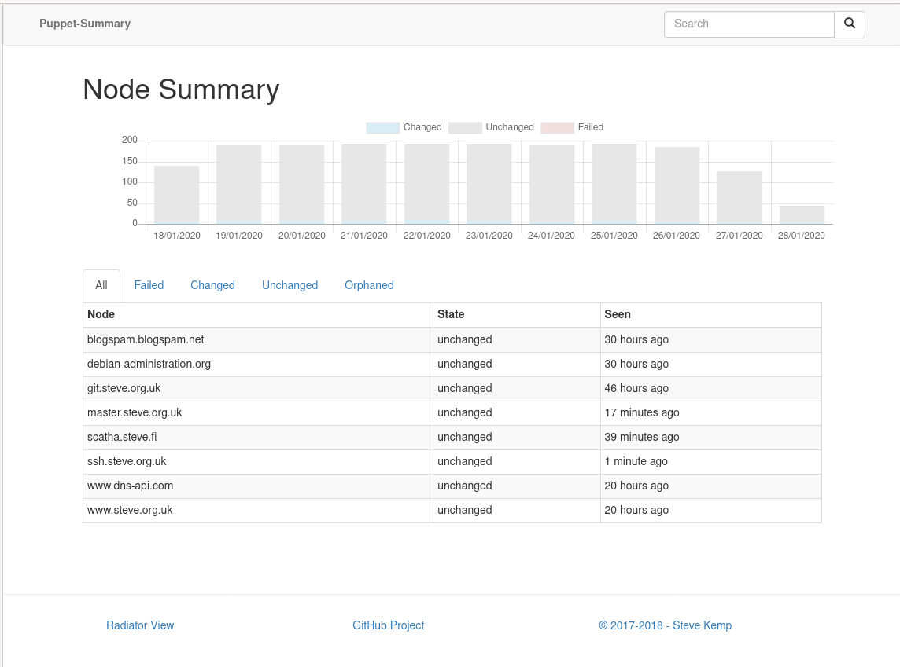
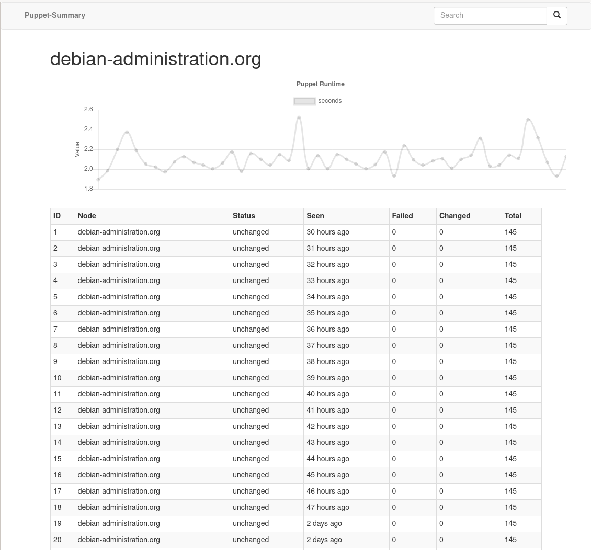
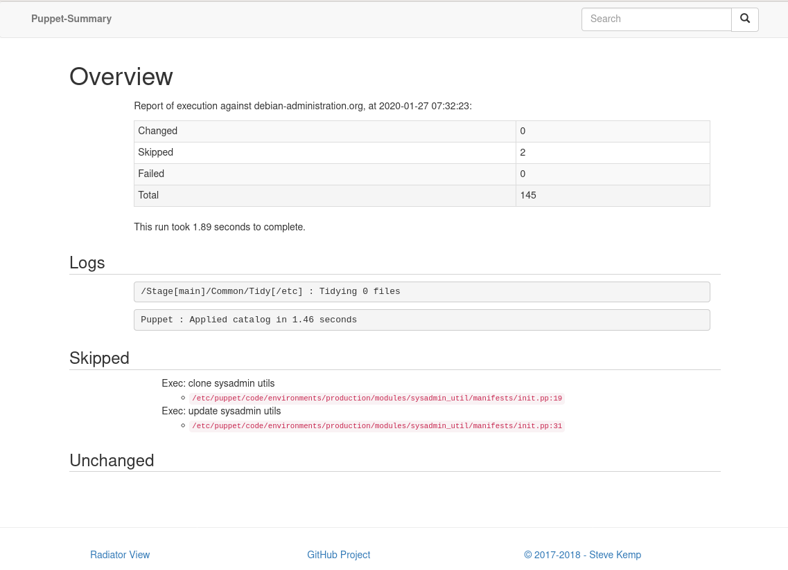

# List of Nodes

There is a summary that shows the list of known-nodes, and their state:

# List of runs

When you select a node you'll details of the last time puppet ran on that node, grouped by state:

# Single Run

Finally if you click upon a run from the section above you'll see details of _what_ happened:

(Sections here can be toggled, via a click.)
